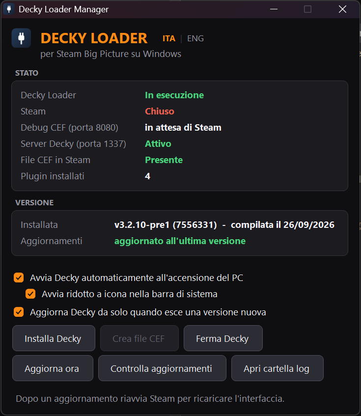

[English](README.md) | **Italiano**

# Decky Manager per Windows

Un pannello di controllo minuscolo (~45 KB) che installa, avvia e tiene aggiornato **[Decky Loader](https://github.com/SteamDeckHomebrew/decky-loader)** — il sistema di plugin dello Steam Deck — dentro **Steam Big Picture su Windows**.

Niente Python, niente Node, niente Git, nessun installer: un solo `.exe` che fa tutto.

[**⬇ Scarica l'ultima versione**](../../releases/latest)



> L'interfaccia è in **italiano** e **inglese**: segue la lingua di Windows e si cambia quando vuoi con **ITA | ENG** accanto al titolo.
>
> La guida completa, con tutti i dettagli e la disinstallazione, è in [docs/GUIDA-IT.md](docs/GUIDA-IT.md).

---

## Cosa fa

| | |
|---|---|
| **Installa Decky** | Scarica la build ufficiale per Windows direttamente dalla CI di Decky Loader e la sistema in `%USERPROFILE%\homebrew`. |
| **Attiva il debugger di Steam** | Crea il file `.cef-enable-remote-debugging` nella cartella di Steam: è l'interruttore che permette a Decky di agganciarsi a Big Picture. |
| **Stato in tempo reale** | Loader, Steam, porte 8080 e 1337, file CEF e plugin installati, tutto a colpo d'occhio. |
| **Avvia e ferma** | Lancia il loader con la cartella di lavoro corretta, oppure lo ferma. |
| **Parte con Windows** | Se vuoi, tramite una scorciatoia di avvio; può restare nascosto nella barra di sistema. |
| **Si tiene aggiornato** | A ogni apertura controlla se c'è una versione più recente di Decky e, se vuoi, la installa da solo. |

Il pulsante arancione indica sempre *la prossima cosa da fare*: creare il file CEF, installare Decky o aggiornarlo. Se nessun pulsante è arancione, è tutto a posto.

## Requisiti

* Windows 10 o 11
* Steam
* Una connessione a internet per installazione e aggiornamenti

Usa il .NET Framework 4.x già incluso in Windows: non c'è niente da installare.

## Installazione

1. Scarica `DeckyManager.exe` dalla [release più recente](../../releases/latest).
2. Aprilo e premi **Installa Decky**.
3. Riavvia Steam completamente e apri Big Picture: Decky è nel menu di accesso rapido.

Non chiede mai i permessi di amministratore. Unica eccezione: se Steam è in `Program Files` e la cartella è protetta in scrittura, il file CEF va creato riaprendo il programma come amministratore, solo per quella volta. Il pannello te lo segnala.

> Windows SmartScreen potrebbe avvisarti che l'app non è riconosciuta, perché l'exe non ha una firma digitale. Clicca *Ulteriori informazioni → Esegui comunque*. Il codice sorgente è tutto qui, e ogni release viene compilata da GitHub Actions a partire da esso.

## Le tre opzioni

* **Avvia Decky automaticamente all'accensione del PC** — aggiunge una scorciatoia nella cartella Esecuzione automatica di Windows.
* **Avvia ridotto a icona nella barra di sistema** — all'accensione parte il pannello stesso, nascosto vicino all'orologio, e avvia lui il loader. Clic sinistro sull'icona per aprirlo, clic destro per il menu. Su Windows 11 le icone nuove finiscono nel riquadro delle *icone nascoste* sotto la freccetta `^`: trascinala sulla barra per tenerla sempre in vista.
* **Aggiorna Decky da solo quando esce una versione nuova** — attiva di serie. A ogni apertura, se esiste una versione più recente, la scarica e la installa senza chiedere nulla, avvisandoti con un fumetto sull'icona. Non lo fa mai mentre è in corso un gioco.

## Come funziona

L'interfaccia di Steam è un'applicazione Chromium (CEF). Con il file `.cef-enable-remote-debugging` presente, Steam apre un debugger sulla porta **8080**. `PluginLoader.exe` di Decky vi si collega, trova la scheda `SharedJSContext` (l'interfaccia React che sta dietro a Big Picture) e vi inietta il proprio frontend, servito da un server locale sulla porta **1337**. Decky Manager è semplicemente ciò che prepara tutto questo e lo tiene in piedi.

**La porta 1337 non è configurabile**: è cablata nel frontend di Decky. Se un altro programma la sta già usando, Decky non può partire. Il colpevole tipico è il servizio **Razer Chroma SDK**; il pannello si accorge del conflitto e ti dice quale processo occupa la porta.

## Aggiornamenti

A ogni apertura il pannello chiede al repository di Decky Loader qual è l'ultima build Windows riuscita nella CI e la confronta con quella installata.

GitHub conserva gli artefatti della CI per circa 90 giorni. Se i file della build più recente non ci sono più, il pannello scorre a ritroso le ultime venti build finché ne trova una ancora scaricabile. I download passano da [nightly.link](https://nightly.link), che serve gli artefatti di GitHub Actions senza bisogno di account.

## Problemi frequenti

* **Decky non compare in Big Picture** — nel pannello devono esserci *Decky Loader: In esecuzione*, *File CEF in Steam: Presente* e, con Steam aperto, *Debug CEF: Attivo*. Poi riavvia Steam completamente: esci davvero, non chiudere solo la finestra.
* **Porta 1337 occupata** — chiudi il programma che il pannello ti indica; per Razer Chroma SDK disattiva il servizio da `services.msc`.
* **Un plugin non funziona** — molti plugin sono scritti per SteamOS e toccano hardware o servizi di sistema (per esempio PowerTools): su Windows non possono funzionare. Quelli di sola interfaccia, come CSS Loader, SteamGridDB o ProtonDB Badges, vanno bene.
* **Il pulsante "Update" dentro Decky non fa nulla** — è un problema noto a monte su Windows. Usa *Aggiorna ora* del pannello.

## Compilazione

```powershell
.\build.ps1
```

Genera `DeckyManager.exe` (~45 KB) usando il compilatore C# già incluso in Windows: niente SDK, niente NuGet, niente Visual Studio.

```powershell
.\build.ps1 -Embed
```

Genera una versione da ~30 MB con dentro i binari del loader di Decky, così può installarlo anche **senza internet**. Leggi la nota sulle licenze qui sotto prima di condividerla.

`tools/build-from-source.bat` è un percorso facoltativo per chi preferisce compilare Decky Loader dai suoi sorgenti (servono Git, Node 20 + pnpm e Python 3.11 + Poetry).

## Licenze

Decky Manager è distribuito con licenza MIT (vedi [LICENSE](LICENSE) e [NOTICE.md](NOTICE.md)).

**Decky Loader è un progetto separato, con licenza GPL-2.0.** Questo repository non contiene nulla del suo codice e le release non includono i suoi binari: vengono scaricati dalla sua CI al momento dell'installazione. Se costruisci una versione con `-Embed`, stai ridistribuendo binari GPL-2.0 e te ne assumi gli obblighi, compreso rendere disponibile il codice sorgente corrispondente.

## Ringraziamenti

Tutto il lavoro vero è del team [SteamDeckHomebrew](https://github.com/SteamDeckHomebrew), che ha scritto Decky Loader e il suo supporto a Windows. Questo progetto si limita a renderlo facile da usare su un PC Windows.
