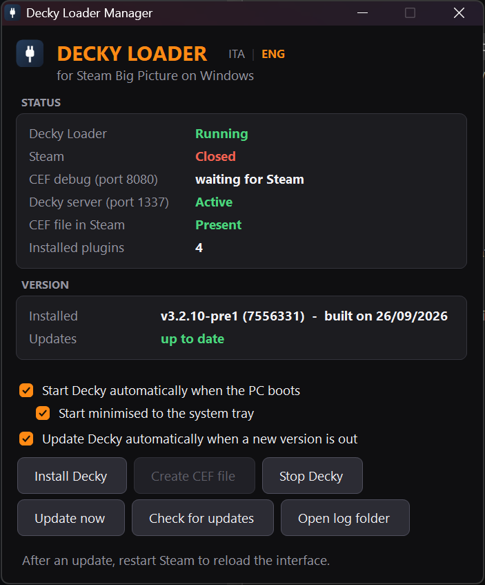

**English** | [Italiano](README.it.md)

# Decky Manager for Windows

A tiny (~45 KB) control panel that installs, runs and keeps **[Decky Loader](https://github.com/SteamDeckHomebrew/decky-loader)** — the Steam Deck plugin system — working inside **Steam Big Picture on Windows**.

No Python, no Node, no Git, no installer: a single `.exe` that does everything.

[**⬇ Download the latest release**](../../releases/latest)



> The interface is available in **English** and **Italian**. It follows your Windows language, and you can switch any time with **ITA | ENG** next to the title.

---

## What it does

| | |
|---|---|
| **Installs Decky** | Downloads the official Windows build straight from the Decky Loader CI and sets it up in `%USERPROFILE%\homebrew`. |
| **Enables Steam's debugger** | Creates the `.cef-enable-remote-debugging` file in your Steam folder — the switch that lets Decky attach to the Big Picture UI. |
| **Live status** | Loader, Steam, ports 8080/1337, CEF file, installed plugins — all at a glance. |
| **Start / stop** | Runs the loader with a proper working directory, or stops it. |
| **Starts with Windows** | Optional, via a Startup shortcut; can sit quietly in the system tray. |
| **Keeps itself current** | Checks for a newer Decky build on every launch and (optionally) installs it by itself. |

The orange button is always *the thing you should do next*: create the CEF file, install Decky, or update. When nothing is orange, you are good.

## Requirements

* Windows 10 or 11
* Steam
* An internet connection for install and updates

It uses the .NET Framework 4.x that ships with Windows — nothing to install.

## Install

1. Download `DeckyManager.exe` from the [latest release](../../releases/latest).
2. Run it and press **Install Decky**.
3. Restart Steam completely, then open Big Picture: Decky is in the quick access menu.

It never asks for administrator rights. The only exception is the CEF file when Steam lives in a write-protected `Program Files`: the app tells you, and you can run it once as administrator just for that step.

> Windows SmartScreen may warn about an unrecognised app, because the exe is not code-signed. Click *More info → Run anyway*. The source is all here, and every release is built from it by GitHub Actions.

## The three options

* **Start Decky automatically when the PC boots** — adds a shortcut to the Windows Startup folder.
* **Start minimised to the system tray** — at boot the panel itself starts hidden near the clock and launches the loader. Left-click the icon to open it; right-click for a menu. On Windows 11 new icons land in the *hidden icons* flyout under the `^` arrow: drag it onto the taskbar to keep it visible.
* **Update Decky automatically when a new version is out** — on by default. On every launch, if a newer build exists it is downloaded and installed silently, with a notification on the tray icon. It never does this while a game is running.

## How it works

Steam's UI is a Chromium (CEF) application. With `.cef-enable-remote-debugging` present, Steam exposes a debugger on port **8080**. Decky's `PluginLoader.exe` connects to it, finds the `SharedJSContext` tab (the React UI behind Big Picture) and injects its frontend, served from a local web server on port **1337**. Decky Manager is simply the thing that sets all of this up and keeps it alive.

**Port 1337 is not configurable** — it is hardcoded in Decky's frontend. If another program is already listening there, Decky cannot start. The usual culprit is the **Razer Chroma SDK** service; the panel detects the conflict and names the process holding the port.

## Updating

On every launch the panel asks the Decky Loader repository for the newest successful Windows CI build and compares it with what you have installed.

GitHub keeps CI artifacts for about 90 days. If the newest build's files are gone, the panel walks back through the last 20 builds until it finds one that is still downloadable. Downloads go through [nightly.link](https://nightly.link), which serves GitHub Actions artifacts without requiring a login.

## Troubleshooting

* **Decky doesn't show up in Big Picture** — the panel should read *Decky Loader: Running*, *CEF file in Steam: Present* and, with Steam open, *CEF debug: Active*. Then restart Steam completely (quit it, don't just close the window).
* **Port 1337 busy** — stop the program the panel names; for Razer Chroma SDK, disable the service in `services.msc`.
* **A plugin doesn't work** — many plugins are written for SteamOS and touch hardware or system services (PowerTools, for example): they cannot work on Windows. UI-only plugins such as CSS Loader, SteamGridDB or ProtonDB Badges work fine.
* **The "Update" button inside Decky does nothing** — a known upstream issue on Windows. Use *Update now* in the panel instead.

## Building

```powershell
.\build.ps1
```

Produces `DeckyManager.exe` (~45 KB) using the C# compiler that ships with Windows — no SDK, no NuGet, no Visual Studio.

```powershell
.\build.ps1 -Embed
```

Produces a ~30 MB build with the Decky loader binaries embedded, so it can install Decky **offline**. Read the licensing note below before sharing such a build.

`tools/build-from-source.bat` is an optional path for people who would rather compile Decky Loader itself from its sources (it needs Git, Node 20 + pnpm and Python 3.11 + Poetry).

## Licensing

Decky Manager is MIT licensed (see [LICENSE](LICENSE) and [NOTICE.md](NOTICE.md)).

**Decky Loader is a separate project, licensed GPL-2.0.** This repository contains none of its code and releases ship none of its binaries: they are downloaded from the project's own CI at install time. If you produce an embedded build with `-Embed`, you are redistributing GPL-2.0 binaries and take on the obligations that come with it — including making the corresponding source available.

## Credits

All the actual magic belongs to the [SteamDeckHomebrew](https://github.com/SteamDeckHomebrew) team, who wrote Decky Loader and its Windows support. This project only makes it easy to use on a Windows PC.
